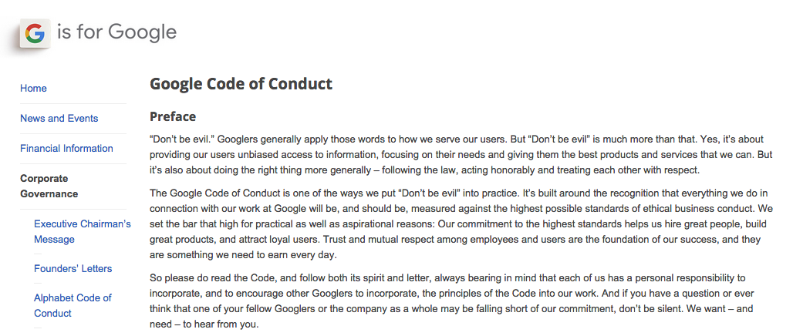

2024年11月16日到20号，不太平静的MEME圈中发生了一件有趣的事情。简单来说，一个北大出身的大V(0xAA_Science)发现了一个已经被原始开发者脱手的meme: scihub，并意识到了这是一个好机会，或许是帮助DeSci(去中心化学术)的好机会，亦或是赚钱的好机会，当然，更有可能的是二者兼有，总之，他购入了20%的scihub代币，并联系Scihub的创始人 Alexandra Elbakyan 计划分批次将代币捐赠。

一开始，Alexandra 的态度是合理的质疑，一方面，分批次的捐助很难不让人起疑心; 另一方面，对于不怎么关注币圈的她来说，将代币冠以scihub的名字在市场上流通，很难不让人觉得这是一种亵渎，尤其是以知识平权为目标的scihub。 

而对于常年混迹web3的投资客们，这种行为也无异于巧妙的营销: DeSci的理念和背靠的扎实项目，让$scihub的叙事成为了乱七八糟的meme众生中的一股清流，而且通过捐助行为，让这个原本无人问津的代币与scihub的联系从仅仅同名上升到了利益相关。在今天的代币海洋，哪怕多几个人喊喊口号炒作炒作故事和概念都可以让代币一飞冲天，更别提如果背靠扎实而具体并且运营多年的项目了。

好了，关于币圈的内容先暂停，现在谈谈所谓的DeSci概念的源头: 网络自由意志主义。

与其他平权运动相同，知识平权也起源于自由意志主义，在互联网黑客中，这体现为网络自由意志主义，其重点在于，减少政府管制审查或其他干涉互联网"自由"的行为。在当时，新兴的互联网通讯技术令政府处于认知混乱的状态，在执法过程中出现了不少侵犯个人自由的案例。 

在此背景下，约翰·吉尔摩等人于1970年成立了电子前线基金会 (Electronic Frontier Foundation)，其主要使命是:

1. 帮助公众了解更多有关计算机和通信领域发展带来的机遇与挑战
2. 促使政策制定者对那些构成通信的自由和开放的基本问题有更好的了解
3. 提高公众对随新计算机通信媒介迅速发展而产生的公民自由问题的认识
4. 为那些受到毫无根据或误导的法律威胁的新技术和个人进行辩护
5. 鼓励和支持新技术的开发，帮助非技术用户可不受任何影响且方便地接触到新通信技术

电子前线基金会为推进当时的互联网自由发挥过不少作用，但更重要的是，它为当时为数不多但在日后具备更多互联网话语权的技术极客们或多或少地传递了自己的理念， 这其中就包括Reddit的联合创始人，同时也是RSS格式和Markdown格式的开发者，“互联网之子” Aaron Hillel Swartz。

受EFF的影响，Aaron在年少的时候就积极参与网络自由相关的事业：14岁参与开发RSS1.0版本，帮助创办了先进社会变革活动委员会，成功制止《禁止网络盗版法案》的颁布等等。

2008年时，Aaron 做出了一个轰动一时的举动：从政府的收费数据库系统中下载了大约270万份联邦法院的文件并让网络大众免费访问。不过按照法律，政府文件不受版权法保护，这些文件原本就是应该公开的，因此即便受到了FBI的调查，Aaron也没有被控告。“幸运” 的他继续在英文维基百科中进行着从2003年以来的编辑活动，在美国政治机构、政府官员等主题上添加了许多条目。

直到他自杀的那一天。

2011年1月6日晚，斯沃茨在哈佛大学校园附近被警察和特工逮捕， 他们发现 Aaron 通过MIT的校园网下载了大量的期刊文章，因此以非法从受保护的计算机中获取信息的罪名检控 Aaron。 而在联邦检察官的介入下，Aaron 新增了九项重罪，面临最高50年的监禁和100万罚款! 在压力下，Aaron选择了上吊。

Aaron的死亡无疑代表了当时美国司法系统中的过分检控和恐吓，更重要的是，他成为了一个符号，一个殉道者，他的死亡激起了全社会各界的广泛关注。人们在白宫网站上要求罢免为Aaron新增罪名的检察官，艺术界用各种涂鸦和壁画纪念他，黑客们攻入了MIT和政府的网站，将页面替换为了对Aaron的纪念和哀悼。

Aaron的死所带来的最深远影响，便是刺激了越来越多的人和组织参与到了开放获取和知识平权中的运动上来，以至于Journal of Library Administration 的一位编委会成员写道，在Aaron死后，“在非开放获取刊物上发表要受到良知的谴责”。可以说Scihub就是这股运动的继承者。

与其他鼓吹scihub的言论相比，我并不是很看重它在免费获取论文上的效果，就个人的有限体验而言，我查询的文献中依旧有很大一部分是scihub没有收录的，而研究生期间，通过学校的校园网就可以下载到那些需要付费订阅的论文，也没有使用scihub的刚需，不过它的存在和发展依旧是值得被认可和支持的，不仅仅是为了它为了那些没有条件的科研人员做出的虽然有限但切实存在的平权努力，更是为了那份传承了三十余年的精神图腾，它让人们在陈腐的商业世界中，依旧能够看到理想主义和早期互联网自由精神的余辉。 

当然，Alexandra 依旧面临着严峻的知识封锁和法律风险，以及更现实的经济问题。尽管有不少志愿者试图传播和帮助Scihub，但范围有限，效果甚微， 部分原因在于，互联网的新生一代正逐渐掌握话语权，而他们生活在一个被前辈"修正"过了的网络世界， 没有经历过矛盾的冲突和历史性的运动，缺乏对网络自由意志主义的认知和体会，最多便是称道一声Respect。 好比只有当你是上世纪三四十年代的中国农民时，才能真正体会到今天政治书里的陈词滥调在当年确实是救国图存的存在。 

社会的健忘不仅为知识平权带来了困难，也让其他曾经被"修复"过的那些问题重新浮现，甚至变得更加高明和棘手，因为政府和商业公司已经学会温水煮青蛙的模式慢慢侵犯用户，而时间和健忘是他们的盟友。试问有谁记得谷歌曾经在自己的行为准则开头中承诺过"Don't be evil"呢? 大部分的人仅仅关心自己的需求能不能满足，至于那"小小"的隐私侵犯? 或许让人不快，但那又如何? 

可以说，互联网的历史，就是人们用隐私和自由换取便利的历史，即便这种交易有时候并不等价。

回到web3，这是一个黑暗森林，也是一个充满了机会的地方。除了为Scihub的推广带来了便利之外，去中心化技术的本质核心，也就是加密技术，同样是当年网络自由意志主义的产物，其背后的一些故事也同样颇具传奇色彩。

1991年，菲尔·齐默曼为了让所有人可以安全访问BBS和存储信息，开发了用于通讯加密的应用程序PGP(Pretty Good Privacy)并发布在互联网上供人免费使用。而在当时的美国，使用大于40位密钥的加密系统被视为军需品。PGP的密钥长度远远超出了这一限制，因此政府以"没有授权的军需品出口"为名对他发起调查，但齐默曼使用了一个天才般的想法去对抗规定: 他将PGP的源代码出版为一本书。 

与军需品出口不同，书本出口和传播符合美国宪法第一修正案中的言论自由部分，因而受到保护，法院因此判定齐默曼无罪。这个案件深刻影响了后来类似案件的司法裁定，而PGP依旧继续发挥着隐私保护的强大作用，它的后辈GPG (GnuPG) 帮助 Edward Joseph Snowden 在逃亡期间联系新闻界，一举揭发了2013年引爆全球的美国棱镜计划。

现如今，加密技术最广为人知的应用之一: 加密货币，当初也是密码学极客当初用来抵御政府的工具，今天的它正在借助其病毒式的传播性和吸引力，让越来越多的人关注到了Scihub这样一个长期运营但始终磕磕绊绊的项目中来，**考虑到它们都可以追溯到五十年前的文化和网络自由意志，即便或许相当不纯粹，这样的联合还是颇有种分家多年的兄弟姐妹互帮互助的感觉。**

的确，一个普遍的常识是，币圈里没有什么纯粹的好人，大部分购入$scihub以及其他DeSci项目的人都是投机客，在丰富的投资经验下，众多meme的空洞而千篇一律的叙事已经无法满足这帮挑剔的老狐狸了，**选择 $scihub 和其他 DeSci，只是选择了一个相对可靠而坚实并且有靠山的叙事，一处借着理想主义发泄投机欲望的渠道**。至于知识平权和开放获取，虽然足够理想也足够动人，但由于上述的原因，终究还是只能被少数人真正领会而不仅仅只是沦为口号。

可即便如此，我还是对这场"合作"的结果抱有兴趣，我想知道，当理想主义者遇上那些抱着狂躁的欲望和手中的热钱的极客、投机犯、骗子、自大狂和狂信徒时，当盲目的资本遇上纯粹的公民运动时，它们是会在不牺牲任何一方原始立场的情况下以一种默契的平衡关系**保持边界**并持续协作，还是相互竞争直到一方被吞噬而沦落为另一方所利用的工具? 如果前者能够成立，那么其带来的积极意义是否适用于其他领域? 而至于后者，我真真切切的不希望发生，因为在那种情况下，受伤害的一方必将有且只有Scihub。

