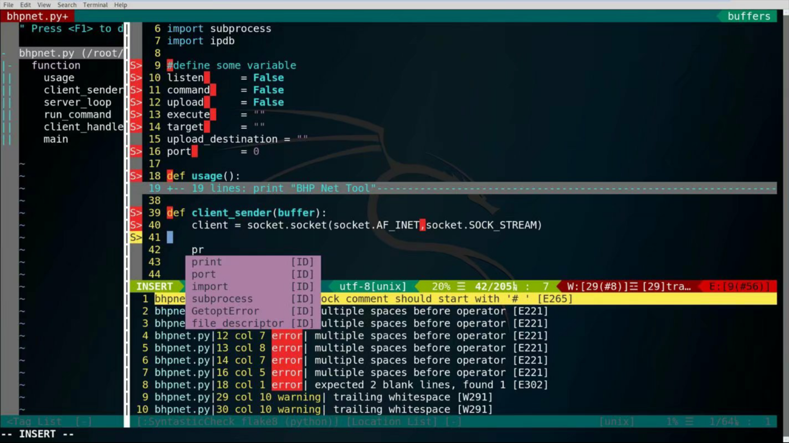

不知不觉使用sway已经整整一年了，于是来谈一谈自己这一年的使用感受，顺便回顾了一下过去。

## 起因

2019年，在一次编程作业的时候，同专业的另一个老哥向我展示了vim的代码h补全，我立刻被这种简陋但是扩展性极强的代码编辑器吸引了，于是当时还是个刚转入计算机专业的小白就开始哼哧哼哧地学习vim的配置和插件的安装。当然，这些都发生在我的Kali Linux虚拟机中。



那个时候我正接触CTF，很多时候都要开着虚拟机，于是有一天动起了把电脑系统直接装成linux的想法。因为自己的第一台笔记本是暗夜精灵2，游戏本装Linux，第一个要考虑的就是兼容性和稳定性，在权衡各个发行版的优势和流行程度后，我选择了ubuntu18.04。笔记本重装完毕后除了风扇转个不停竟然一切运行正常，这让我实在有些惊喜，而风扇问题是英伟达独显导致的，在ubuntu上，只需要一条`sudo ubuntu-drivers autoinstall`就完美解决了。当时的自己很开心，仿佛打开了一道新世界的大门。

后来，我去吉林参加了第一次线下赛，ubuntu没有掉链子，帮我拿了一个一血，我很满意。直到一次上课，手贱执行了`apt upgrade`，升级完电脑竟然无法开机了，一整个无语，而当时临近期末，我已经没有时间再去折腾系统了，于是紧急安装了windows应付期末复习，顺便下单了一台对Linux更加友好的笔记本Thinkpad T480。

期末考试结束后，我听说了Arch Linux 的大名，但是出于畏难情绪，我选择将ubuntu18.04安装在我的thinkpad t480上，然后去参加xman的夏令营。在夏令营期间，我的电脑在连接wifi一段时间后就再也连接不上了，第一次我选择了重装，但是第二次还是同样的问题，我只好绝望地回到windows10，事后分析的时候，我觉得应该是驱动的问题，thinkpad t480是2018年下半年发布的，ubuntu18.04的驱动可能确实没覆盖到它的网卡。

之后的好几个月里，我都乖乖用着windows10和WSL2，实习的时候全程在虚拟机里面写代码。等到实习结束、保研也结束的时候，我又开始了新一轮的折腾。

2020年下半年，我将自己的主力电脑全面迁移到了Manjaro Linux下，那个时候qv2ray还很活跃，我的科学上网也很依赖它，但是有好几次在更新的时候发生了Manjaro特有的问题：软件的版本更新上来了，但是软件的依赖没有更新上来，这种问题也影响了trilium等软件，虽然不能怪manjaro，但是我还是愤而转向了Arch Linux，一直到今天我也还在用。

转到Arch Linux之后，我基本上不再改变自己的发行版了，只是会在图形界面折腾一些。2020年-2021年上半年我使用的都是KDE，好看是真好看，但是Bug也是真的致命，这其中我亲身经历过的至少三次重复出现在不同电脑（thinkpad T480出现过，thinkbook 14p 出现过）的bug就是盒盖睡眠失败，我不知道是谁引起的，是plasma还是conky还是别的什么组件，我不知道，我在日志里也查不到。别看这个问题好像没什么，但是作为一个笔记本用户，盒盖后放进包里是一个非常自然的行为，回到宿舍没有第一时间拿出电脑而是休息一会也是很正常的行为，但是休息完后发现自己的电脑在包里变成了一个铁板烧就不是一个正常的现象了。嘴硬的人当然会说thinkpad不是有指示灯吗？你看指示灯判断是否睡眠成功不就行了？且不说我后来的电脑thinkbook 14p是没有指示灯的，单就系统质量而言，一个系统每次使用的时候都需要用户小心翼翼盯着指示灯看，是否已经说明了这是一个糟糕的系统了？为什么换成thinkbook？就是因为这个bug把我的thinkpad的主板烧坏了！我曾以为这是thinkpad独有的问题，可是当thinkbook也发生同样问题的时候我对KDE彻底失望了，是的，这是一个很漂亮的桌面环境，定制性强又有很多特效，可是这一切都建立在一些不稳定的bug上的时候，这些特效会更多扮演起bug的导火索角色。

经历过KDE的bug后，我对复杂的桌面环境产生了恐惧，他们就像是一枚不定时炸弹。在这个前提背景下，我接触并开始使用SwayWM，一直到今天，我也还在使用，而那个致命Bug，已经离我远去。

## 体验

得益于Arch Linux庞大的用户群，Arch 的软件包生态在一众发行版中可以说是称王称霸了，我举一个例子，你能想象在Linux的软件仓库中会出现deepin-wine魔改后的腾讯系软件吗？


每次看到其他发行版用户手动下载deb然后安装的时候，我都会产生一种他们是不是在用windows的错觉，并不是看不起别的发行版，只是各有分工和侧重点，比如Arch的定位是桌面端用户，而很多别的发行版的定位是服务器，我不会用别的发行版当作我的桌面系统，就像我不会把Arch装在服务器上一样。用统一的包管理器管理软件包肯定是有好处的，能够大大减轻用户的心智负担。

至于网络上提到的Arch Linux不稳定、容易滚挂的问题，不好意思，我用了两年Arch了，每天都执行`yay -Syyu`，从来没有出现滚挂的问题，相反，我目前所遇到的半数Linux相关问题，都是因为系统软件或者依赖库过于老旧而导致的，更新后就可以解决。Linux不是Windows，如果你不想要更新，那么有两种选择，第一种，锁定自己的软件版本，然后在每次安装新软件的时候单独解决依赖问题；第二种，回去用windows。

说完了Arch Linux，再来说说Sway，这是一个简单的wayland窗口管理器，为什么用wayland，因为我不希望自己的图形界面建立在一个老旧而难以维护的基础设施之上，那给我的感觉就好像我在使用另一个plasma。诚然，wayland还有很长的一段路要走，很多桌面软件都不得不借助xwayland才能在其上运行，经过实际使用，除了在4k屏幕上xwayland有问题之外，其他情况下还是可以完美工作的。当然，部分软件是有问题的，比如腾讯会议的桌面共享功能，但是也已经有了曲线救国的办法，所以现在wayland的生态已经比之前要好一些了，当我看到linux qq内测群里有人提出wayland下的问题以及要求兼容wayland的时候，我就相信未来还会更好。

Sway是一个窗口管理器，开发者做的事情是在wayland下复刻一个i3wm出来。窗口管理器的好处是我现在更多依赖键盘而不是鼠标了，可以减少对视觉聚焦于鼠标这种行为的依赖，转而更多依赖自己的触觉，另外，更少的特效和更简洁的设计不仅让我的系统大大增强了稳定性（据一位用KDE的同学说，直到今天，用KDE只要一周不关机就必定会崩溃），还让我自己更加专注于手头的工作（平铺式窗口管理器的统一好处）。不好的地方当然也有不少，比如初次接触的时候要花很多时间去配置和适应，比如每次修改操作键位的时候都需要一定时间去重新适应，比如fcitx5在某些软件下面无法工作或者是有缺陷（这不是fcitx5的锅），比如它让我认识到自己是一个很笨蛋的人，使用了一年了，让我时不时就发现自己的操作习惯可以有优化空间，比如：

- 在按win+数字键的时候，用大拇指去按是很扭曲的姿势，**一个更加自然的姿势是用左手的掌心左下（手背视角）的部分去压win键，然后用手指去按数字键。**如果要按ctrl+win，就用同样的部位压住两个键，这个难度会大一些，大概确实还可以优化的。
- 调整窗口大小的时候，进入resize模式然后用键盘去按是很低效的行为，相反，这种时候依赖鼠标不是什么坏事，通过把鼠标悬停在窗口上然后按住右键进行拖拽就可以实现快速的窗口大小调整。
- scratchpad中更适合使用tab模式。
- 有的时候在两个workspace之间切换会很频繁，这个时候更适合用`workspace back_and_forth`而不是一直执着于用数字键去切换，或者使用鼠标的滚轮来切换，这也是一个不错的主意。

除此之外还有一个小的优点，在sway下可以给不同键盘换上不同的布局，这点对我而言是刚需，但是在xorg下面，这种操作往往只能将同一个布局应用于所有的键盘，一旦布局出现了问题导致键盘不可用，那么所有的键盘都会变得不可用。

最后，我和大部分的geek用户不一样，我比较笨，只是一个普通用户，我做不到也不想去和他们一样视鼠标如洪水猛兽，相反，sway下我还是会频繁使用鼠标，对我来说用鼠标去交互两个窗口的位置依旧是比用键盘更加高效的操作。**所以我想说的是，追求属于自己的实用性，你可以去参考别人的建议，但是最终还是要找到属于你自己的习惯。** 对于我个人来说， 我也完全不排除在plasma的bug修复后回到plasma的可能性，毕竟老牌桌面。

列出我使用的软件：

- 桌面环境
    - SwayWM（窗口管理）
    - waybar（信息展示栏）
- 终端
    - alacritty
- 浏览器
    - firefox-developer-edition （主力）
    - chrome
- 输入法
    - fcitx5
- 代码编辑
    - Neovim（主力）
    - Vscode（副手）
    - Jetbrains
- 做笔记
    - Neovim-qt
    - zotero
- 文件浏览器
    - ranger
    - dolphin
- 看论文
    - zotero
    - okular
- 游戏
    - steam（泰拉瑞亚、黑暗之魂……）
    - waydroid（明日方舟）
    - HMCL（minecraft）
- 工具替代
    - exa 替代 ls
    - zoxide 替代 cd
    - scp 替代 cp

## Trouble Shooting

### 关机的时候出现 a stoping job is running for xxx hangout

修改`/etc/systemd/system.conf`

```
DefaultTimeoutStopSec=5s
```


### JAVA程序在wayland下无法启动

添加环境变量

```
_JAVA_AWT_WM_NONREPARENTING=1
```


### AVD 在wayland下无法启动

用下面的语句启动android-studio再去启动avd

```
QT_QPA_PLATFORM=xcb _JAVA_AWT_WM_NONREPARENTING=1 android-studio
```


### wayland下玩游戏

添加环境变量

```
SDL_VIDEODRIVER=x11
```


### waybar 在sway启动后很久才出现

sway配置中添加

```
exec hash dbus-update-activation-environment 2>/dev/null && \
	dbus-update-activation-environment --systemd DISPLAY WAYLAND_DISPLAY SWAYSOCK
```


### sway 顶部栏出现中文后高度变化

在sway配置文件中添加以下设置来统一使用一个高高的字符的高度.

```
for_window [title=".*"] title_format ゜%title゜
```

### wayland下的腾讯会议

首先新建虚拟摄像头

```bash
sudo modprobe v4l2loopback devices=1 video_nr=10 card_label='OBS Cam' exclusive_caps=1
sudo modprobe snd-aloop index=10 id='OBS Mic'
pacmd 'update-source-proplist alsa_input.platform-snd_aloop.0.analog-stereo device.description="OBS Mic"'
```

然后打开obs，点击要共享的屏幕，点击start virtual camera。这个时候再进入腾讯会议，选择视频（不是屏幕共享），然后把视频的输入源切换到这个虚拟摄像头就可以达到屏幕共享的效果了。

### GTK问题

不要在环境变量中设置`GDK_BACKEND=wayland`, GTK程序会自动优先选择wayland,如果不行会自动切换到xwayland

### error: GPGME error: No data

```
sudo rm -f /var/lib/pacman/sync/*
sudo pacman -Sc
```

